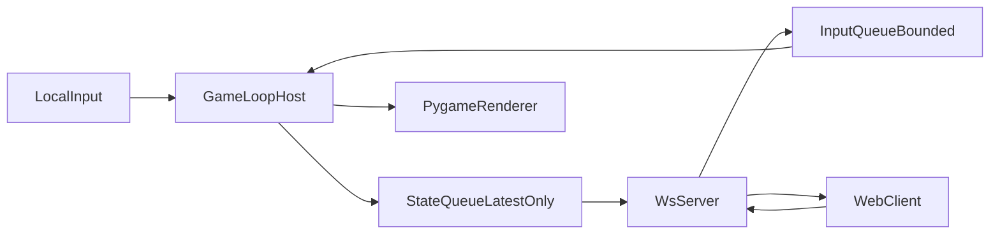

# Architecture

## Runtime components

- `pyBomberMarv.py`  
  Host process, authoritative game loop, pygame rendering, input queue drain, state queue publish.

- `ws_stream_server.py`  
  WebSocket server for remote input + state broadcast and HTTP diagnostics endpoints.

- `web_client/`  
  Browser client: slot selection, resilient WS connection, send-on-change input, adaptive rendering.

## Data flow

## Key design points

- Authoritative simulation stays on host.
- The host loop owns timing (`pyBomberMarv.simulate_step`). `Game.simulate(dt, now)` advances one step and never sleeps; `Game.tick()` is a compatibility wrapper around it.
- Web clients only send input and render received state. The canvas interpolates player `x`/`y`/`direction` and snaps teleports; the board cache hashes cells in place.
- Gameplay deltas are entity-grain (`player_patches`, `player_removed`, `board_patches`) with a full-list fallback.
- Input queue and state queue use bounded non-blocking semantics to avoid stalls.
- State broadcast uses latest-state semantics to prioritize low latency over full history.
- Protocol is versioned (`2`) and validated server-side.

## Refactor direction

- Keep `Game` behavior stable while extracting focused modules incrementally:
  - queue/protocol/runtime helpers first
  - then replay/prep/domain services
- Remove wildcard imports over time to make dependencies explicit.
