<p align="center">
  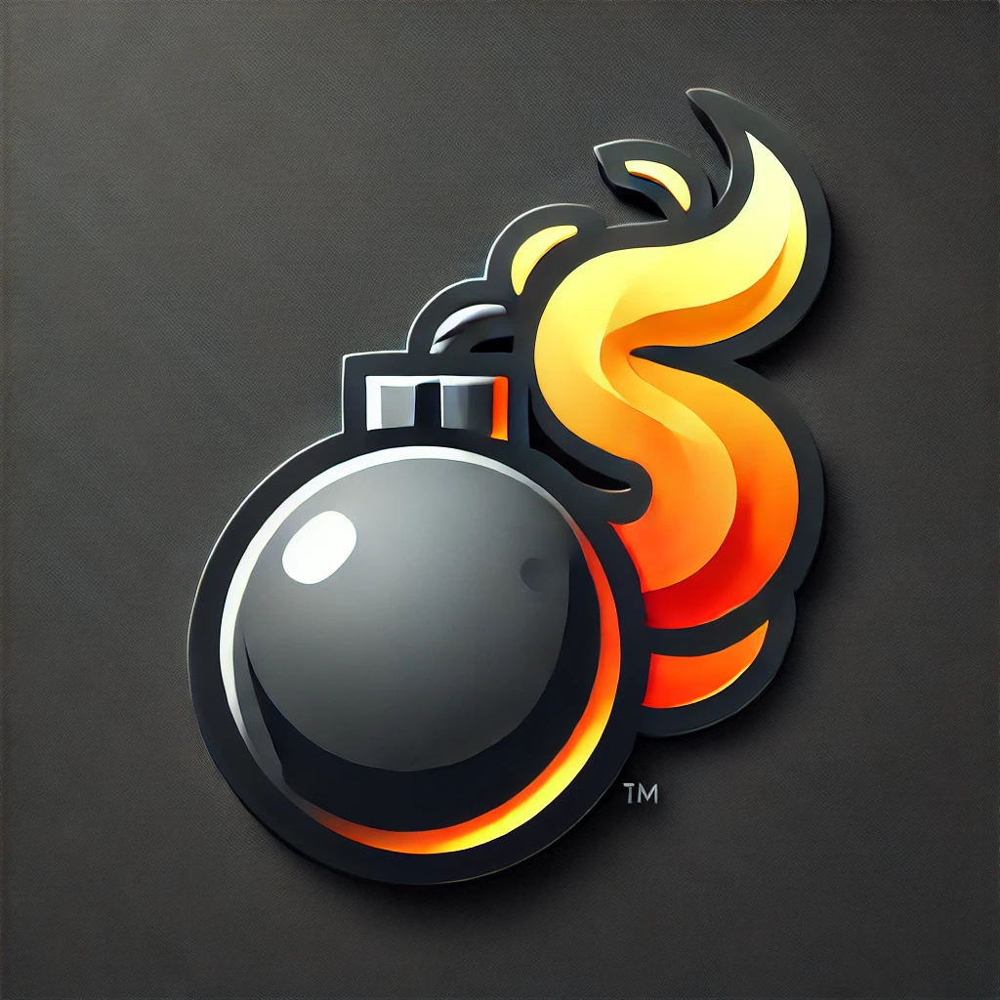
</p>

<h1 align="center">BomberMarv</h1>

<p align="center">
  A LAN Bomberman-style party game. One PC hosts the match in a pygame window;
  everyone else joins from a browser on the same Wi-Fi.
</p>

<p align="center">
  
  
  
</p>

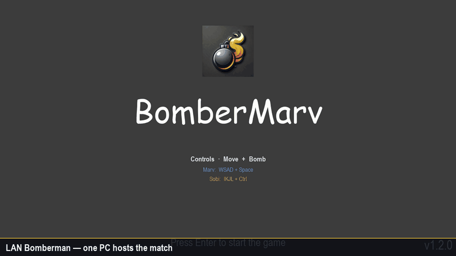

BomberMarv is built for a living-room LAN: up to eight players, CPU opponents, trophies, and a kill-cam on the win screen. The host simulation is authoritative. Phones and laptops only send input and draw the state they receive.

## Download

The Windows host is the zip on the latest [GitHub Release](https://github.com/roborros/BomberMarv/releases/latest). Source is the `dev` branch.

| Package | Link |
| --- | --- |
| **Windows host (no Python install)** | [BomberMarv-windows.zip](https://github.com/roborros/BomberMarv/releases/latest/download/BomberMarv-windows.zip) |
| **Source zip** | [dev branch](https://github.com/roborros/BomberMarv/archive/refs/heads/dev.zip) |
| **Git clone** | `git clone https://github.com/roborros/BomberMarv.git` |

The Windows zip is a folder, not a single-file installer. Unzip it, keep `BomberMarv.exe` next to the bundled `img/`, `sounds/`, and web files, then double-click the exe. Friends open `http://<host-ip>:8080` in a browser.

## How to

### What you need

- **Host PC:** Windows, macOS, or Linux with Python 3.11+, [pygame](https://www.pygame.org/), and the packages in `requirements.txt`.
- **Remote players:** any modern browser. No install.
- **LAN/WLAN** on the same network. This is not an internet game.

For the Windows exe you only need the unzipped folder on the host.

### Play from source (recommended while developing)

1. Clone the repo and install Python deps:

   ```bash
   git clone https://github.com/roborros/BomberMarv.git
   cd BomberMarv
   python -m pip install -r requirements.txt
   ```

2. Install [Bun](https://bun.sh/) (or Node/npm) for the web client.

3. From the repo root:

   ```bash
   python run_all.py
   ```

   That starts the pygame host and the Vite dev server. The console prints join URLs, for example:

   ```
   Client URL (this PC): http://127.0.0.1:5173
   Client URL (LAN):     http://192.168.1.20:5173
   ```

4. On the host, use the pygame window (lobby → Start Game).
5. On phones/laptops, open the LAN URL, type a name, press Log in, then wait for the host to start.

To run the host without Vite (pygame only):

```bash
python pyBomberMarv.py
```

Packaged Windows builds serve the web client from port **8080** instead of 5173. Same idea: open the URL printed in the console.

### Build the Windows folder

On Windows, from repo root:

```bash
python compile_windows.py
```

Output:

- `dist/BomberMarv/BomberMarv.exe` — copy the whole `BomberMarv` folder
- `dist/BomberMarv-windows.zip` — the file attached to the GitHub Release

Python and Bun stay required only on the machine that *builds*. Players of the zip do not need them.

### LAN party checklist

- Host on Ethernet when you can; clients on 5 GHz / 6 GHz Wi-Fi.
- Allow Python / `BomberMarv.exe` through the host firewall for ports **8080** (HTTP) and **8765** (WebSocket).
- Everyone must be on the same subnet (guest Wi-Fi isolation will block joins).
- Test one browser client on the host (`http://127.0.0.1:5173` or `:8080`) before people sit down.

## Features

### Lobby for mixed local, remote, and CPU players

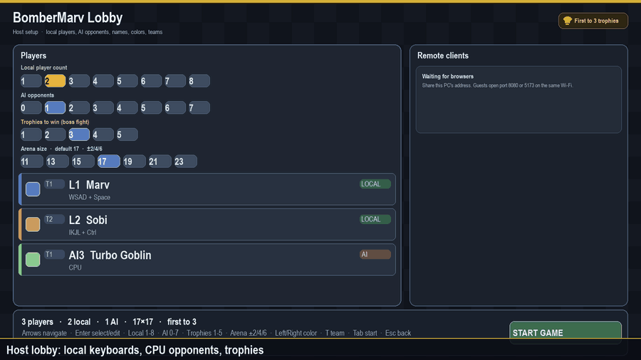

The host sets local player count, AI count, and trophies needed to become champion. Remote browsers show up live with name, slot, and latency. Local names, colors, and optional teams are edited in this screen.

### Bombs, blast chains, and scared faces

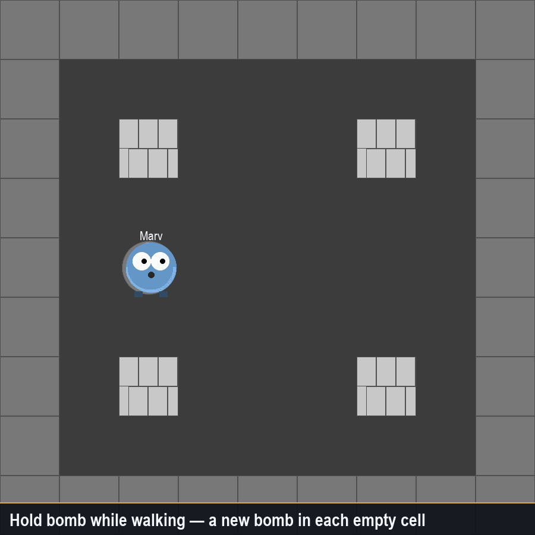

Hold the bomb button to keep planting as you walk. Soft bricks pop, blasts chain through other bombs, and players get a scared look when they are standing in a planned blast. A soft brick stays solid until its flame pulls back. Players also bump into each other. A blast that covers 50 or more cells within 700 ms plays the loud hit (`mocny_stral`) 300 ms later, at full volume. Size, window, delay, and volume are match settings, and browsers use the same values.

### Powerups

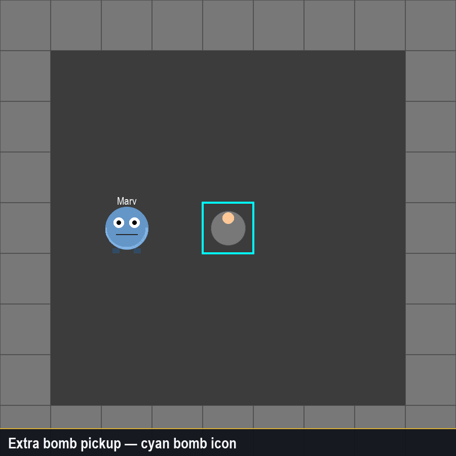

| Pickup | Effect |
| --- | --- |
| Extra bomb | +1 bomb you can have on the board at once |
| Fire | +1 blast range |
| Quad Damage | huge bombs, extra capacity, and a speed boost (20 seconds at the default settings) |
| Death bonus | dropped where someone dies — random speed, fire, or bombs |

Soft walls have a chance to spawn bomb/fire pickups (25% by default). Quad Damage can appear from 60 seconds into the round. Each tick after that has a 0.05% chance to drop one. Chance per tick, delay, duration, strength, and speed boost are all match settings.

### Crushing walls

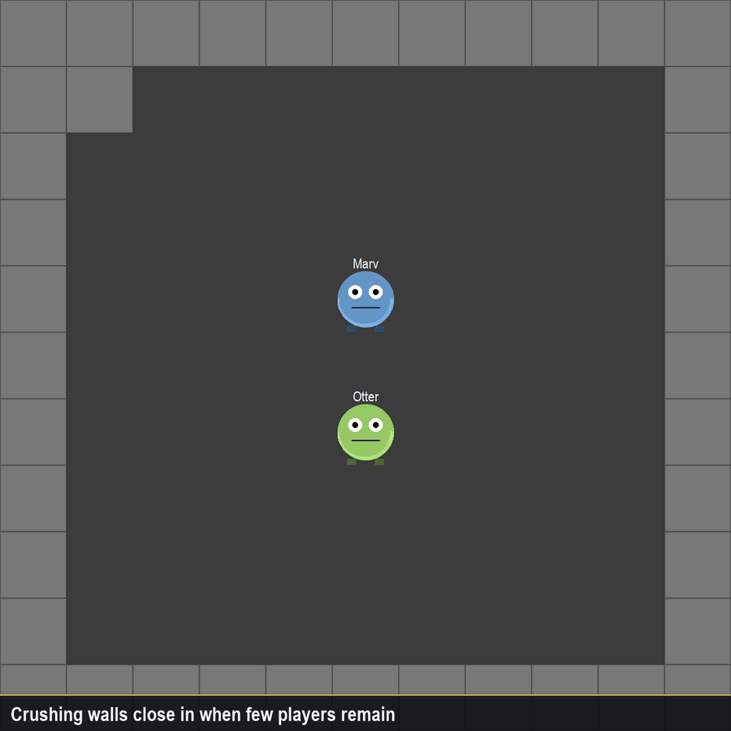

When few players remain, indestructible walls crawl in clockwise and squeeze the arena. They never start before 120 seconds. By default a crowded match waits 120 seconds, a two-player start waits 180 seconds, and each new wall appears every 1.2 seconds. Those waits and the close speed are match settings. If more than two players are still alive and fewer than 15% of the soft walls remain, the walls start at 1.5 times that wait. At twice that wait they start even if the soft walls are still standing.

### CPU match

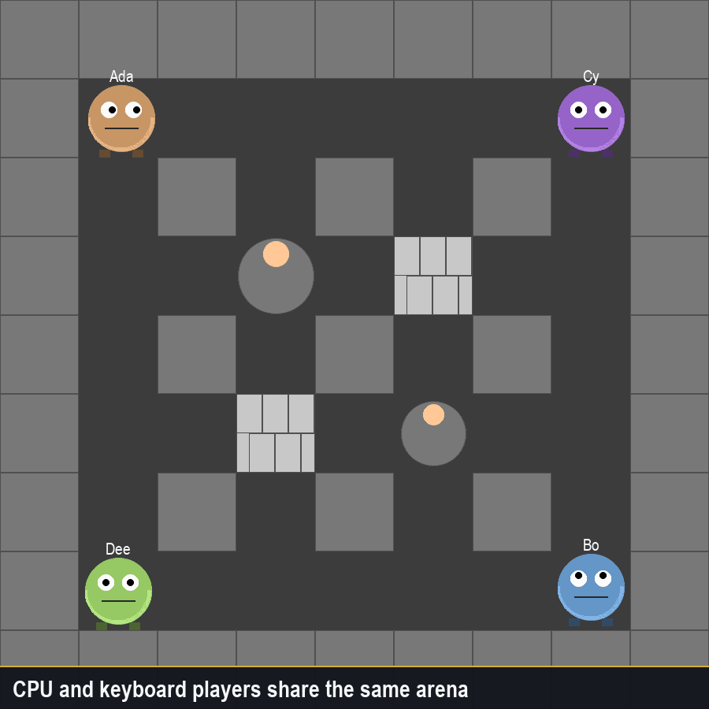

CPU players hunt, dodge fuses, and plant. Each one rolls a style at the start of a series: cautious (one bomb, grabs bonuses, leaves if you get close), normal (bombs nearby players it can cut off, and spends extra bombs on bricks), or crazy (chases, plants whenever it can, and beelines Quad Damage). On a nearly cleared map they stop farming and try to cut the other players off. You can run a full match with zero humans, or mix one keyboard with a pack of AIs.

### Win screen, stats, and kill-cam

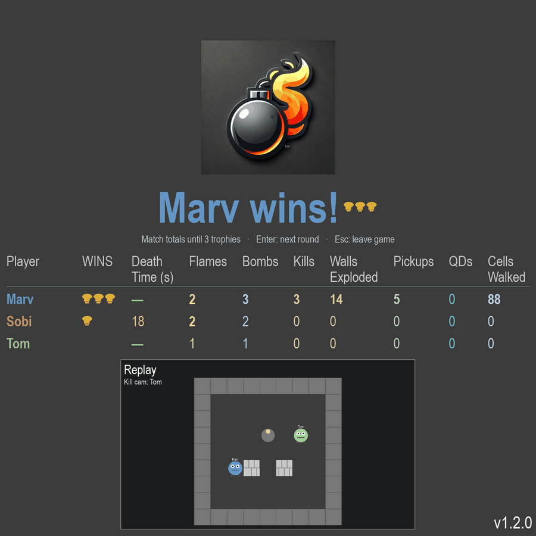

Each round shows trophies, death time, flames, bombs, kills, walls exploded, pickups, Quad Damages, and cells walked. A looping kill-cam sits under the table.

### Pause and leave

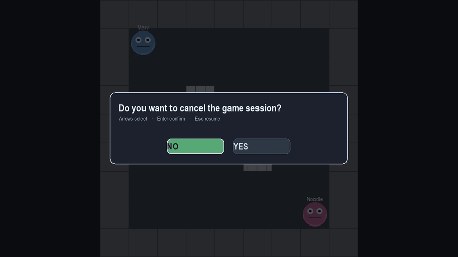

Esc during a round pauses the sim and asks whether to cancel the session. The match clock is shifted so nobody is punished for the pause.

## Manual

### Match flow

1. Title → lobby.
2. Host configures players and presses **Start Game** (or Tab to the Start Game button, then Enter).
3. **Get Ready** countdown, then play.
4. Last player standing (or last team, if teams are on) wins the round and takes a trophy.
5. Enter starts the next round. Stats accumulate until someone hits the trophy goal.
6. **R** resets trophies and starts a new series.

### Host lobby

| Key | Action |
| --- | --- |
| Arrow keys | Move the cursor |
| Enter | Confirm a count, start the match, or edit a name |
| Left / Right on a player row | Cycle color |
| T on a player row | Cycle that local player's team (enables team mode) |
| Tab | Jump to **Start Game** |
| S, or Left from Start then Enter | Open match settings (saved on this PC) |
| Esc | Back to title (or cancel name edit) |

Rows: local player count (1–8), AI opponents (0–7), trophies to win (1–5), arena size (±2 / ±4 / ±6 tiles), then the roster. Left and Right change the highlighted count, including arena size.

### Match settings

Open them from the lobby with **S**, or move Left from **Start Game** and press Enter. Left and Right change the highlighted value, Enter steps it up (or toggles an on/off row). A value that is not the default is marked with a dot and an amber row. **R**, or the **Reset defaults** row, puts every setting back. Esc returns to the lobby. Each change is saved immediately and still applies after a restart. On Windows the file is `%LOCALAPPDATA%\BomberMarv\settings.json`.

| Setting | Default | Range |
| --- | --- | --- |
| Players block each other | On | On / Off |
| Friendly fire | Off | On / Off. Only matters when teams are on. Your own bomb still hits you. |
| Player speed | 1.15× | 0.8× – 2.0× |
| Starting bombs | 1 | 1 – 5 |
| Starting fire | 1 | 1 – 8 |
| Bomb fuse | 3 s | 1 – 8 s |
| Blast duration | 400 ms | 200 – 1200 ms |
| Powerup chance | 25% | 0 – 100% |
| Quad Damage chance / tick | 0.05% | 0 – 1% |
| Quad Damage delay | 60 s | 0 – 180 s |
| Quad Damage time | 20 s | 5 – 60 s |
| Quad Damage strength | +10 bombs and fire | +2 – +15 |
| Quad Damage speed | 1.5× | 1.0× – 2.5× |
| Crushing walls start | 120 s | 60 – 360 s, but never sooner than 120 s. Same for every player count and the boss fight. With no other condition, walls start at twice this (240 s). |
| Walls close every | 1200 ms | 400 – 3000 ms |
| Loud hit size | 50 tiles | 10 – 200 tiles |
| Loud hit window | 700 ms | 100 – 3000 ms |
| Loud hit delay | 300 ms | 0 – 2000 ms |
| Loud hit volume | 100% | 0 – 100% |

### In-match keys (host window)

| Key | Action |
| --- | --- |
| F11 | Fullscreen |
| Esc | Pause / leave prompt |
| Enter | Confirm leave, or continue from the win screen |
| R | Reset the series |
| Alt+K+L | Kill every opponent (host test cheat) |

### Local player controls (host keyboards)

| Player | Move | Bomb |
| --- | --- | --- |
| 1 | WASD or arrows | Space |
| 2 | I J K L | Left Ctrl |
| 3 | F / C / V / B | H |
| 4 | Numpad 5 / 1 / 2 / 3 | Right Ctrl |
| 5 | Home / Delete / End / Page Down | Backspace |
| 6 | Numpad / 7 / 8 / 9 | Numpad 0 |

Hold bomb to plant a trail as you enter empty cells. You cannot stack two bombs in one cell, and you cannot plant on a pickup.

### Browser clients

| Key | Action |
| --- | --- |
| Arrow keys or W A S D | Move |
| Space | Bomb |
| Enter | Start / continue, matching the host |

In the browser lobby: type a display name and press **Log in**. The host assigns a free seat. Optionally tick **Show game screen**. The canvas interpolates other players and predicts your own movement a little so Wi-Fi jitter hurts less.

### Combat rules

- Soft (light) bricks explode; dark bricks do not. A blown-open soft brick stays solid until the flame pulls back.
- Bombs you just planted let you walk out of that cell; after you leave, the bomb blocks the tile.
- Players block each other unless **Players block each other** is turned off in lobby settings. The collision circle is smaller than the drawn sprite. The setting is saved and still applies after a restart.
- Team mode is opt-in from the lobby. Friendly fire is off unless you turn it on in match settings.
- A blast covering enough cells inside the loud-hit window plays `mocny_stral`. The default is 50 cells inside 700 ms, then a 300 ms delay at full volume.

### Corner sliding, chain blasts, and the kill box

BomberMarv does not snap you to a grid. If you walk into the corner of a wall while you are already past the midpoint of that edge, you **slide around** instead of sticking. Use that to peek without committing to the next tile.

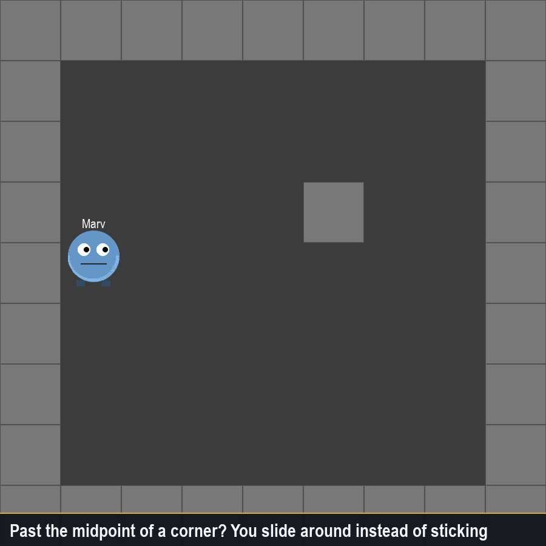

Bombs detonate in a **chain**: a blast that reaches another bomb's cell sets that bomb off immediately, even if its fuse still had time left. Chains stop at dark bricks and at the first soft brick in each direction.

The painted flame stops at the **center of the last cell**. The **kill box** is the inner 70% of each flaming tile, and your hurt radius is about 30% of a half-cell. The clip below is the in-game debug overlay: red inner rectangles on every active blast cell.

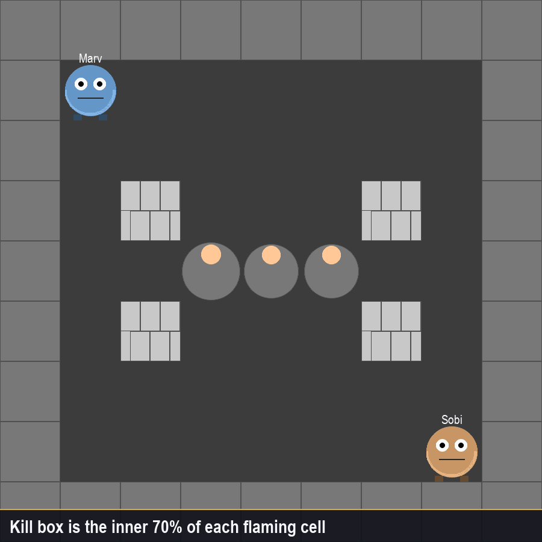

### Arena size

Defaults follow the roster. The host lobby can shift that default by ±2 / ±4 / ±6 tiles.

| Situation | Default grid |
| --- | --- |
| 1–2 players | 15×15 |
| 3–4 players | 17×17 |
| 5–6 players | 19×19 |
| 7–8 players | 21×21 |

### Network (players)

- Host pygame window is always in the match.
- Browsers talk to the host over WebSocket (`8765`). Control messages stay JSON; gameplay can use MessagePack.
- If WebRTC is available, input/state can move to a data channel automatically, with WebSocket fallback.
- Internet play, NAT traversal, and dedicated servers are out of scope.

### Network (host diagnostics)

| URL | What it is |
| --- | --- |
| `GET /health` | Liveness |
| `GET /status` | Clients, slots, names |
| `GET /metrics` | Queue / broadcast counters |
| `GET /config` | Input sending config |
| `GET /versions` | WS / HTTP versions |

Useful flags (defaults are already set by `run_all.py`):

| Flag | Meaning |
| --- | --- |
| `BM_RTC_ENABLED=1` | Allow WebRTC negotiation |
| `BM_RTC_FORCE_WS=1` | Force WebSocket-only gameplay |
| `?rtc=0` on the client URL | Disable RTC in that browser |
| `?strict=1` | Tick-indexed input (LAN experiment) |

## Develop

```bash
python run_tests.py
```

That runs import smoke, Python `unittest`, web Vitest, and `tsc --noEmit`.

Individually:

```bash
python test_imports.py
python -m unittest discover -s tests -p "test_*.py"
cd web_client && bun test && bun run build
```

Regenerate the README animations from the real pygame renderer:

```bash
python tools/capture_readme_gifs.py
```

### Layout

| Path | Role |
| --- | --- |
| `pyBomberMarv.py` | Host loop, pygame window, sim + render |
| `ws_stream_server.py` | WebSocket + HTTP diagnostics (+ packaged web client) |
| `bm_classes.py` | Players, bombs, rounds, lobby |
| `web_client/` | TypeScript browser client |
| `docs/ARCHITECTURE.md` | Runtime diagram and design notes |
| `docs/PROTOCOL.md` | Wire protocol v2 |
| `docs/PERF_TUNING.md` | LAN latency tuning |

## License

[MIT](LICENSE)
